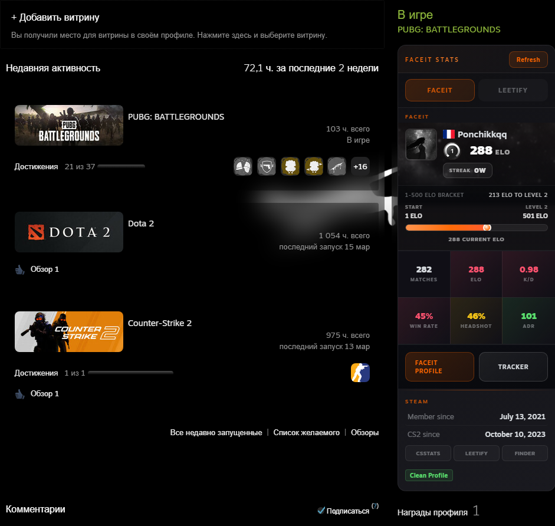

# **FACEIT Stats Modern for [Millennium](https://steambrew.app)**

### 🏆 Enhanced **[FACEIT](https://faceit.com)** and **[Leetify](https://leetify.com)** integration with modern design for Steam profile pages!




## ⚡ Features

� **Complete FACEIT Stats** — ELO, K/D, Win Rate, Headshot %, ADR, Matches  
🔹 **Level Icons** — Beautiful skill level badges (1-10) displayed next to ELO  
🔹 **Win Streak** — Compact streak indicator with gradient colors  
🔹 **ELO Progress Bar** — Visual progress tracker to next level  
� **Leetify Integration** — Premier rank, aim rating, positioning, utility stats  
🔹 **Recent Match** — Last game details with performance metrics  
🔹 **Steam Info** — Member since, CS2 start date, playtime, VAC status  
🔹 **Modern UI** — Sleek dark design with orange accents and smooth animations  
🔹 **Dual Tabs** — Switch between FACEIT and Leetify stats seamlessly

## 📥 Installation

> **Recommended:** Install from [Steambrew](https://steambrew.app) for automatic updates.

### Manual Installation:

1. **Download** the latest release from [Releases](https://github.com/Ponchik0/FaceitStatsModern/releases)
2. **Extract** the folder to your Steam plugins directory:
   - **Windows:** `C:\Program Files (x86)\Steam\plugins`
   - **Linux:** `~/.local/share/Steam/plugins`
3. **Restart Steam** or reload Millennium
4. **Enable** the plugin in Millennium settings

## 🎮 Usage

Simply open any Steam profile — if the user has a linked FACEIT account, their stats will appear automatically in the right column.

**Features:**
- Click **FACEIT tab** to view FACEIT stats with ELO progress
- Click **LEETIFY tab** to view Leetify performance metrics
- Click **Refresh** button to reload stats
- Hover over stats for additional details

## 🛠️ Building from Source

Clone the repository:
```bash
git clone https://github.com/Ponchik0/FaceitStatsModern.git
cd FaceitStatsModern
```

The plugin uses Python backend and TypeScript frontend. No build step required — just copy to plugins folder.

## 📋 Requirements

- [Millennium](https://steambrew.app) installed
- Steam client
- Internet connection for API calls

## 🔧 Configuration

The plugin stores settings in `user_settings.json`:
- `layout_mode` — "full" or "compact"
- `show_faceit_background` — Show/hide cover image
- `colorize_metrics` — Enable colored stat indicators
- `show_last_match` — Display recent match card
- `default_tab` — "faceit" or "leetify"

## 📌 Notes

⚠️ This plugin uses **WebKit injection** to display stats in Steam browser. Review code before installing from untrusted sources.

🔑 **API Keys:**
- FACEIT API key is included (public access)
- Leetify API key optional (set `LEETIFY_API_KEY` env variable for enhanced access)

## 🎨 Customization

All styles are in `static/faceit_stats.css`. You can customize:
- Colors (CSS variables in `:root`)
- Sizes and spacing
- Animations and transitions
- Layout and positioning

## 📸 Screenshots

### FACEIT Tab
- Player avatar with country flag
- ELO rating with level icon (32x32px)
- Win streak badge with gradient colors
- Progress bar to next level
- 6 stat cards: Matches, ELO, K/D, Win Rate, Headshot %, ADR

### Leetify Tab
- Premier rank with tier colors
- Leetify rating change
- Aim, positioning, utility scores
- Recent match details with outcome

### Steam Section
- Member since date
- CS2 start date
- Total hours and last 2 weeks
- Quick links to CSSTATS, Leetify, SteamID Finder
- VAC/Trade ban status

## 🤝 Contributing

Contributions are welcome! Feel free to:
- Report bugs
- Suggest features
- Submit pull requests
- Improve documentation

## 📄 License

MIT License - feel free to modify and distribute

## 🙏 Credits

- Original concept inspired by [alowave/millennium-faceit-stats](https://github.com/alowave/millennium-faceit-stats)
- FACEIT API for player data
- Leetify API for performance metrics
- Millennium framework by SteamClientHomebrew

---

**Made with ❤️ for the CS2 community**
